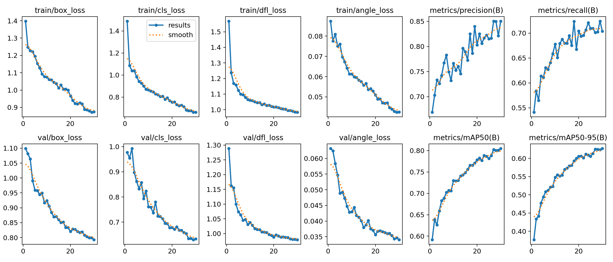
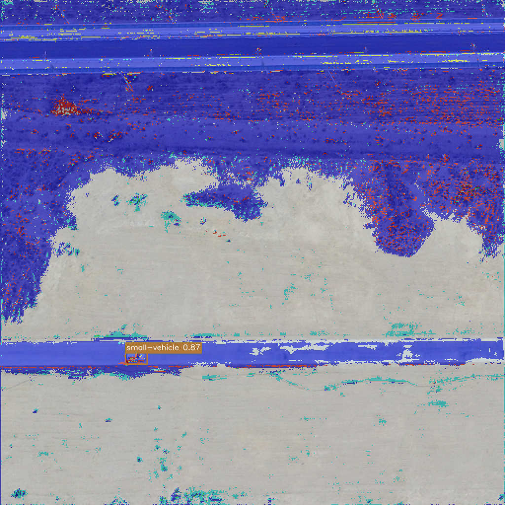

Aerial Image Segmentation + Detection
=====================================

.. |python| image:: https://img.shields.io/badge/python-3.12-blue.svg
   :target: https://www.python.org/
   :alt: Python

.. |pytorch| image:: https://img.shields.io/badge/PyTorch-ROCm-ee4c2c.svg
   :target: https://pytorch.org/
   :alt: PyTorch

|python| |pytorch|

Dual-model pipeline for aerial imagery:

* **YOLOv8 OBB** for oriented-bounding-box detection, trained on the VSAI
  dataset (``redzapdos123/vsai-dataset-yolo11-obb-format`` via kagglehub).
* **U-Net** for 6-class semantic segmentation, trained on the ISPRS Potsdam
  patches dataset (``deasadiqbal/private-data-1`` via kagglehub).

The two models are trained **independently** on **separate datasets** and
combined **only at inference time**.

Target hardware: AMD RX 6700S (gfx1032) running a ROCm build of PyTorch.

Project layout
--------------

::

   aerial-image-segmentation/
   ├── web/                     Flask UI (upload, results, training figures)
   ├── figures/                 optional PNGs for README (training / inference)
   ├── config.yaml              unified hyperparameters (YOLO + U-Net + paths)
   ├── requirements.txt
   ├── Dockerfile               rocm/pytorch:latest base + project deps
   ├── docker-run.sh            GPU passthrough wrapper
   ├── infer.py                 combined YOLO + U-Net inference CLI
   ├── data/
   │   ├── download_potsdam.py  kagglehub download (idempotent)
   │   ├── download_vsai.py     kagglehub download + writes vsai_dataset.yaml
   │   ├── vsai_dataset.yaml    auto-generated by download_vsai.py
   │   ├── potsdam_dataset.py   PyTorch Dataset + color-map helpers
   │   └── augmentations.py     Albumentations pipelines (train / val / infer)
   ├── models/
   │   ├── unet.py              pure-PyTorch U-Net
   │   └── yolo.py              thin ultralytics wrapper
   ├── train/
   │   ├── train_unet.py        U-Net training loop
   │   └── train_yolo.py        YOLOv8-OBB training driver
   ├── inference/
   │   ├── pipeline.py          orchestrates both models, writes artifacts
   │   ├── combine.py           overlay mask + draw OBB polygons
   │   └── visualization.py     palette helpers
   ├── utils/
   │   ├── cfg.py               YAML config loader
   │   ├── device.py            ROCm-safe device + HSA override helper
   │   ├── checkpoint.py        torch save/load
   │   └── seed.py              deterministic seeding
   └── tests/
       ├── test_unet_smoke.py
       ├── test_dataset_potsdam.py
       ├── test_augmentations.py
       ├── test_combine.py
       ├── test_infer_synthetic.py
       ├── test_cfg.py
       ├── test_device.py
       ├── test_vsai_yaml.py
       ├── test_overfit_batch.py       (marked ``slow``)
       └── rocm_check.sh               hardware validation script

Hardware & ROCm compatibility
-----------------------------

The RX 6700S reports as ``gfx1032`` and is **not** officially supported by
ROCm. The workaround is to pretend we are on ``gfx1030``:

::

   export HSA_OVERRIDE_GFX_VERSION=10.3.0

All training / inference entrypoints apply this override automatically *before*
``import torch``. The Docker image and ``docker-run.sh`` set it too, so you do
not normally need to export it manually. All code uses
``torch.device("cuda")`` (ROCm surfaces as the CUDA API) and avoids any
NVIDIA-only calls.

Environment setup
-----------------

Option A (preferred): Docker
~~~~~~~~~~~~~~~~~~~~~~~~~~~~

::

   ./docker-run.sh                          # interactive shell
   ./docker-run.sh python infer.py --image sample.jpg

The script builds the image (``rocm/pytorch:latest`` + project deps) on first
run and passes ``--device=/dev/kfd --device=/dev/dri --ipc=host --shm-size=8G``
to expose the GPU.

Option B: Local install (Python 3.12)
~~~~~~~~~~~~~~~~~~~~~~~~~~~~~~~~~~~~~

::

   # Install the ROCm PyTorch wheels first (outside the sandbox).
   pip install torch torchvision --index-url https://download.pytorch.org/whl/rocm6.2
   pip install -r requirements.txt

Python 3.12 fallback
~~~~~~~~~~~~~~~~~~~~

Ultralytics 8.x and the ROCm PyTorch build support 3.12. If you hit an
incompatibility (``torch.compile`` for instance is gated by Python 3.12),
downgrade to Python 3.11 and create a second venv:

::

   python3.11 -m venv .venv311
   source .venv311/bin/activate
   pip install torch torchvision --index-url https://download.pytorch.org/whl/rocm6.2
   pip install -r requirements.txt

Dataset preparation
-------------------

Both datasets are downloaded lazily (and cached) via ``kagglehub``:

::

   python -m data.download_potsdam         # U-Net: ISPRS Potsdam patches
   python -m data.download_vsai            # YOLO: VSAI OBB; also writes data/vsai_dataset.yaml

Training
--------

U-Net
~~~~~

::

   HSA_OVERRIDE_GFX_VERSION=10.3.0 python -m train.train_unet
   python -m train.train_unet --epochs 30 --batch-size 4 --lr 1e-4
   python -m train.train_unet --resume results/unet/checkpoints/best.pth

YOLOv8 OBB
~~~~~~~~~~

::

   HSA_OVERRIDE_GFX_VERSION=10.3.0 python -m train.train_yolo
   python -m train.train_yolo --epochs 100 --batch 8 --imgsz 1024

Example figures (training & inference)
----------------------------------------

Drop PNG screenshots under ``figures/`` (paths below). Until those files exist,
GitHub may show broken image icons—this section documents the intended layout.

**Training — YOLO (e.g. Ultralytics ``results.png``)**

Copy from ``results/yolo/<run_name>/results.png`` after a run, or export your own
plot, to:

::

   figures/training_yolo.png

   *Placeholder:* YOLOv8-OBB training curves (loss components, mAP50, mAP50-95).
   Replace ``figures/training_yolo.png`` with your export.

**Training — U-Net**

Copy a loss plot from TensorBoard, a notebook, or a simple matplotlib export of
``train_loss`` / ``val_loss`` vs epoch to:

::

   figures/training_unet.png

.. figure:: figures/training_unet.png
   :width: 100%
   :align: center
   :alt: U-Net training and validation loss vs epoch

   *Placeholder:* U-Net segmentation loss (train vs val). Add after
   ``python -m train.train_unet`` finishes.

**Inference — combined output**

After ``python infer.py --image …``, copy the composite (or a crop) to:

::

   figures/inference_composite.png

   *Placeholder:* ``result.png`` style view—semantic mask overlay plus YOLO OBB
   polygons and labels.

Combined inference
------------------

::

   python infer.py --image path/to/aerial.jpg

Writes artifacts to ``results/inference/``:

* ``detections.json`` — list of OBB detections (class, confidence, 4 corners).
* ``mask.png`` — colorized 6-class semantic segmentation (full resolution).
* ``uncertainty.png`` — U-Net per-pixel entropy heatmap (colormap PNG).
* ``result.png`` — the input image with the mask overlay and OBB polygons.

Web UI (Flask)
--------------

Browser upload and visualization for the same combined pipeline as ``infer.py``.
Use the **same Python environment** as CLI inference (PyTorch, Ultralytics,
OpenCV, etc.).

::

   pip install -r requirements.txt -r requirements-web.txt

If you see ``No module named 'cv2'``, OpenCV is missing — run
``pip install opencv-python-headless`` (or reinstall both requirement files
above).

From the **repository root** (so ``config.yaml`` and weights paths resolve):

::

   flask --app web.app:create_app run --host 0.0.0.0 --port 5000

Open http://127.0.0.1:5000/ — upload an image, optional inference thresholds,
then view composite, mask, uncertainty map, plots (class mix, YOLO analytics),
detection crops, and detections. After a successful POST, the app responds with
**HTTP 303** so the browser does not replay the upload on Back; responses for
result pages and job artifacts use ``Cache-Control: no-store, private`` to
avoid stale thumbnails when navigating history.

Per job (under ``web/uploads/<uuid>/``) the UI may show ``out/input_preview.png``,
``out/class_mix.png``, ``out/yolo_analytics.png``, and ``out/crops/crop_NN.png``
in addition to the CLI outputs above.

Optional: set ``WEB_CLEAR_UPLOADS_ON_START=1`` to delete existing contents of
the upload directory each time the app starts (default off; useful for dev).

**Production:** use a **single** worker so only one inference uses the GPU at a time:

::

   gunicorn -w 1 -b 0.0.0.0:5000 'web.app:create_app()'

Optional: set ``MAX_UPLOAD_MB`` (default 50) to cap upload size.

**Docker:** the image installs ``requirements-web.txt`` and exposes port 5000.
Override the container command, for example:

::

   ./docker-run.sh gunicorn -w 1 -b 0.0.0.0:5000 'web.app:create_app()'

Tests
-----

::

   pytest                                   # unit + integration (no GPU needed)
   pytest -m slow                           # longer CPU overfit test
   ./tests/rocm_check.sh                    # GPU smoke (device, forward, backward)
   ./tests/rocm_check.sh --with-training    # + 1-epoch U-Net and YOLO runs

Constraints
-----------

* Models are trained independently on **separate** datasets.
* No instance segmentation — YOLO handles detection, U-Net handles semantic
  segmentation, and they are combined only at inference time.
* All CUDA-specific / NVIDIA-only APIs are avoided; the code runs on ROCm.
